SQL Produkty i Sprzedaż 2025

Opis projektu

Projekt przedstawia przykładową bazę danych SQLite do nauki języka SQL i podstaw analizy danych sprzedażowych. Baza zawiera produkty z numerami EAN, kodami SKU, opisami i parametrami, a także klientów, dostawców, stany magazynowe, zamówienia i płatności.

Dane sprzedażowe obejmują rok 2025. Projekt pokazuje praktyczne wykorzystanie filtrowania, sortowania, agregacji, JOIN, funkcji tekstowych, obliczania marży oraz analizy sprzedaży według produktów, kategorii, kanałów i miesięcy.

Technologie

•
SQLite

•
SQL

•
PowerShell

•
Visual Studio Code

•
Git i GitHub

Zawartość bazy

Baza obejmuje 60 produktów, 400 klientów, 3 000 zamówień z 2025 roku, 7 522 pozycji zamówień, 6 kategorii, 6 dostawców oraz stany magazynowe w dwóch magazynach.

Pliki projektu

Plain Text

.
├── produkty_sprzedaz_2025.sqlite
├── produkty_sprzedaz_2025.sql
├── README.md
└── docs/
    └── screenshots/
        ├── 1.png
        ├── 2.png
        ├── ...
        └── 18.png

Plik .sqlite jest gotową bazą do wykonywania zapytań. Plik .sql jest tekstowym dumpem, który pozwala odtworzyć strukturę i dane w nowej bazie.

Uruchomienie w Windows

W PowerShellu przejdź do katalogu projektu:

Plain Text

cd "C:\Users\matty\Downloads\sql-produkty-sprzedaz-2025"

Uruchom bazę:

Plain Text

C:\sqlite\sqlite3.exe ".\produkty_sprzedaz_2025.sqlite"

Po pojawieniu się promptu sqlite> wykonaj:

SQL

.headers on
.mode column
.tables

Przykładowe zapytanie:

SQL

SELECT produkt_id,
       ean,
       sku,
       nazwa,
       marka,
       cena_sprzedazy_netto
FROM produkty
LIMIT 5;

Nie wpisuj znaków PS> ani sqlite> — są to prompty wyświetlane automatycznie przez terminal.

Najważniejsze tabele

Tabela
Opis
produkty
Produkty, EAN, SKU, ceny i parametry
kategorie
Kategorie produktów i stawki VAT
dostawcy
Dostawcy, kraje i oceny
klienci
Klienci B2C i B2B
zamowienia
Daty, kanały i statusy zamówień
pozycje_zamowien
Produkty i ilości w zamówieniach
platnosci
Informacje o płatnościach
stany_magazynowe
Ilości produktów w magazynach
v_sprzedaz_szczegoly
Widok ułatwiający analizę sprzedaży

Przykładowe raporty

Sprzedaż i zysk według kategorii

SQL

SELECT
    kategoria,
    ROUND(SUM(wartosc_netto), 2) AS sprzedaz_netto,
    ROUND(SUM(cena_zakupu_netto * ilosc), 2) AS koszt_zakupu,
    ROUND(SUM(wartosc_netto - cena_zakupu_netto * ilosc), 2) AS zysk_netto,
    SUM(ilosc) AS sprzedane_sztuki
FROM v_sprzedaz_szczegoly
WHERE status = 'Zrealizowane'
GROUP BY kategoria
ORDER BY zysk_netto DESC;

Top 5 produktów według ilości

SQL

SELECT produkt,
       ean,
       marka,
       kategoria,
       SUM(ilosc) AS sprzedane_sztuki,
       ROUND(SUM(wartosc_netto), 2) AS sprzedaz_netto
FROM v_sprzedaz_szczegoly
WHERE status = 'Zrealizowane'
GROUP BY produkt_id, produkt, ean, marka, kategoria
ORDER BY sprzedane_sztuki DESC,
         sprzedaz_netto DESC
LIMIT 5;

Sprzedaż według kanałów dystrybucji

SQL

SELECT kanal,
       COUNT(DISTINCT zamowienie_id) AS liczba_zamowien,
       SUM(ilosc) AS sprzedane_sztuki,
       ROUND(SUM(wartosc_netto), 2) AS sprzedaz_netto,
       ROUND(SUM(wartosc_brutto), 2) AS sprzedaz_brutto
FROM v_sprzedaz_szczegoly
WHERE status = 'Zrealizowane'
GROUP BY kanal
ORDER BY sprzedaz_netto DESC;

Dokumentacja wizualna

Poniższe screeny są przypisane zgodnie z rzeczywistą zawartością plików w folderze docs/screenshots.

1. Uruchomienie bazy i sprawdzenie katalogu

PowerShell przechodzi do katalogu projektu, wyświetla pliki, uruchamia SQLite i pokazuje prompt sqlite>.

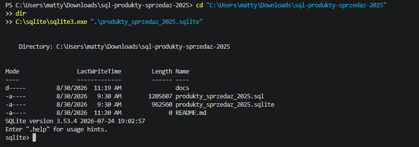

2. Lista tabel

Ustawiono nagłówki i tryb kolumnowy, a następnie wykonano .tables. Wynik pokazuje tabele i widok dostępne w bazie.

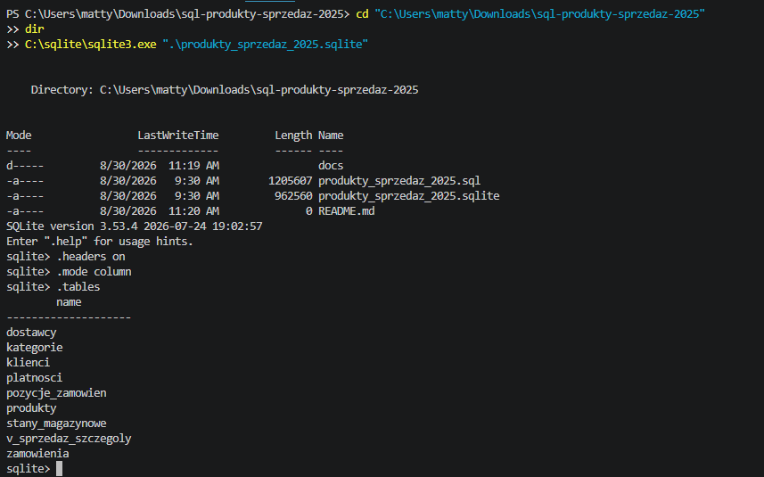

3. Schemat tabeli produktów

Polecenie .schema produkty pokazuje definicję tabeli, klucz główny, klucze obce, ceny, EAN, SKU i ograniczenia danych.

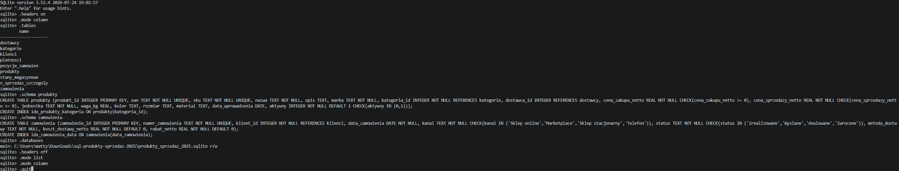

4. Wybrane kolumny produktów

Zapytanie prezentuje wybrane informacje z tabeli produkty, w tym identyfikator, EAN, SKU, nazwę, opis i parametry.

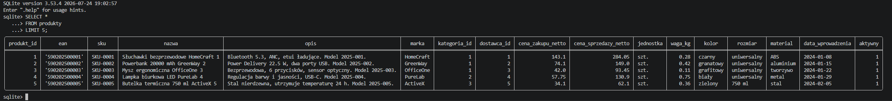

5. Pełne rekordy produktów

Zapytanie SELECT * FROM produkty LIMIT 5 pokazuje pięć pełnych rekordów wraz ze wszystkimi kolumnami tabeli.

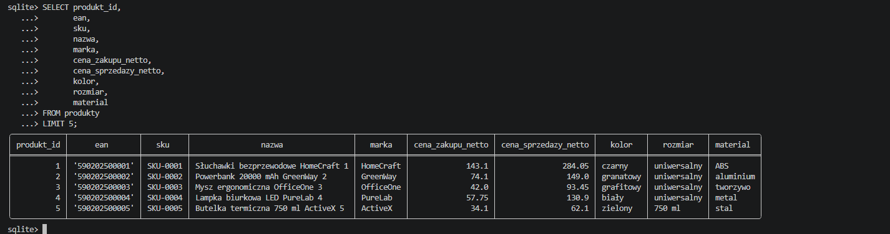

6. Filtrowanie produktów po cenie

Zapytanie wybiera aktywne produkty w przedziale cenowym od 50 do 150 zł i sortuje je według ceny malejąco.

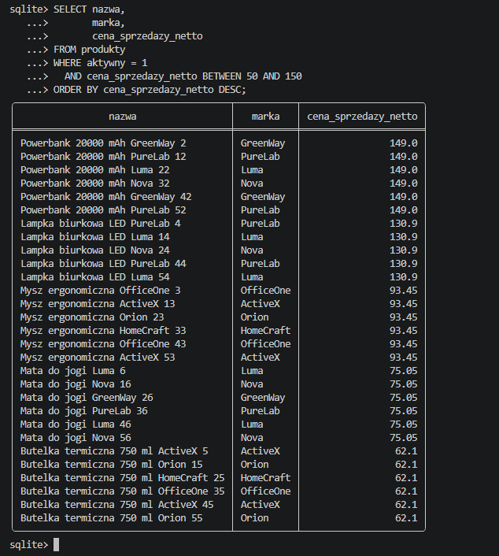

7. Najdroższe produkty

Zapytanie wybiera 10 produktów o najwyższej cenie sprzedaży netto.

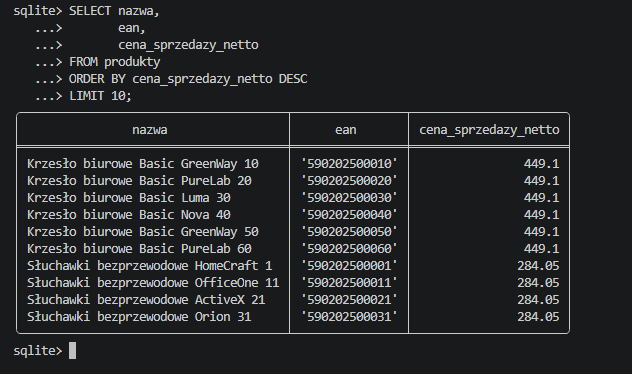

8. Wyszukiwanie tekstowe LIKE

Zapytanie wykorzystuje LIKE do znalezienia produktów, których nazwa zawiera słowo „bezprzewodowe”.

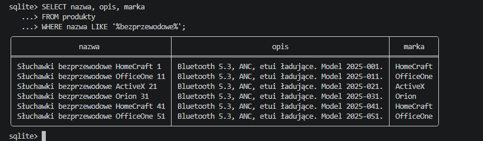

9. JOIN produktów, kategorii i dostawców

Zapytanie łączy tabele produkty, kategorie i dostawcy, pokazując kategorię, dostawcę, kraj oraz cenę produktu.

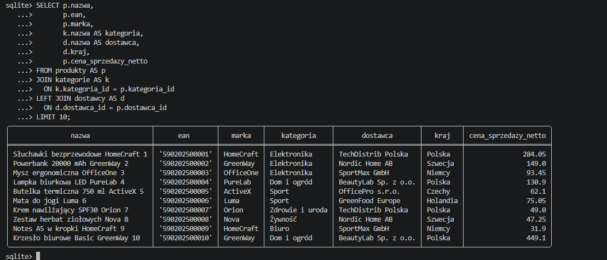

10. Sprzedaż i zysk według kategorii

Raport pokazuje sprzedaż netto, koszt zakupu, zysk netto i liczbę sprzedanych sztuk dla każdej kategorii.

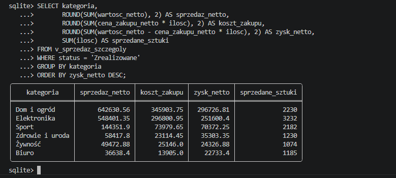

11. Marża procentowa według kategorii

Raport oblicza marżę procentową jako udział zysku netto w sprzedaży netto.

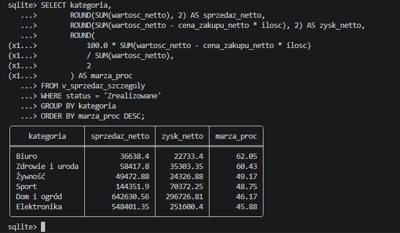

12. Top 5 produktów według ilości

Raport pokazuje pięć produktów o największej liczbie sprzedanych sztuk. Drugim kryterium sortowania jest sprzedaż netto.

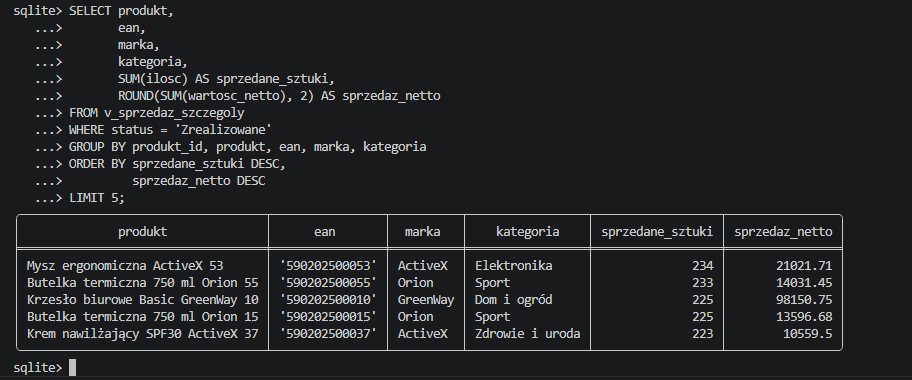

13. Pełny ranking produktów według ilości

To rozszerzona wersja rankingu bez LIMIT 5, pokazująca wszystkie produkty uporządkowane według sprzedanych sztuk.

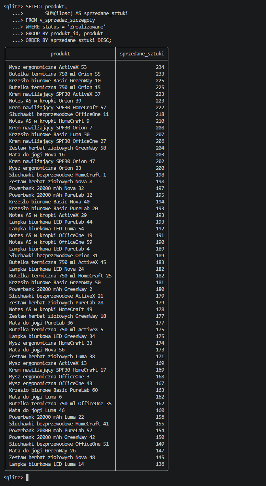

14. Sprzedaż według kanałów dystrybucji

Raport porównuje liczbę zamówień, sprzedane sztuki, sprzedaż netto i sprzedaż brutto w kanałach dystrybucji.

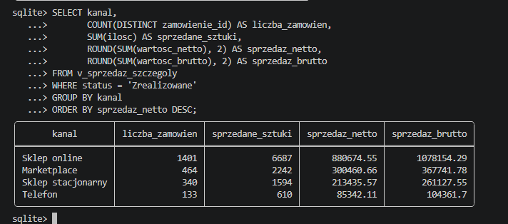

15. Udział kanałów w sprzedaży

Zapytanie wykorzystuje funkcję okna do obliczenia procentowego udziału każdego kanału w całkowitej sprzedaży netto.

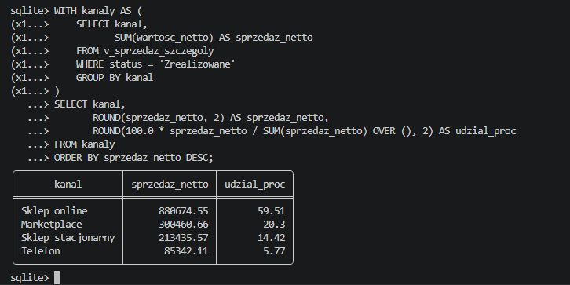

16. Sprzedaż miesięczna w 2025 roku

Raport grupuje sprzedaż po miesiącu i pokazuje liczbę zamówień, sprzedane sztuki oraz sprzedaż netto.

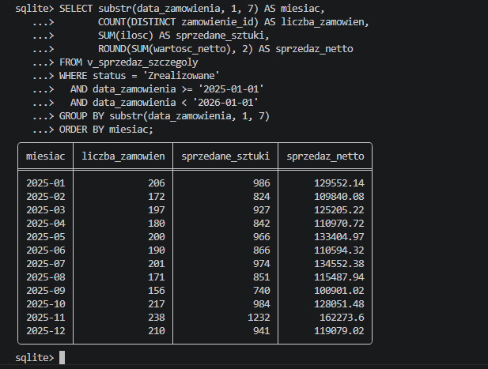

17. Najlepszy miesiąc sprzedażowy

Zapytanie wybiera miesiąc z najwyższą sprzedażą netto. W przedstawionym wyniku jest to listopad 2025.

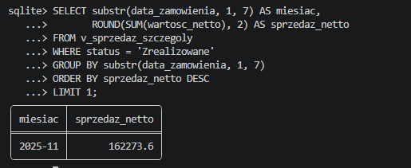

18. Produkty poniżej progu magazynowego

Raport pokazuje SKU, nazwę produktu, magazyn, dostępną ilość i próg zamówienia dla produktów wymagających uzupełnienia.

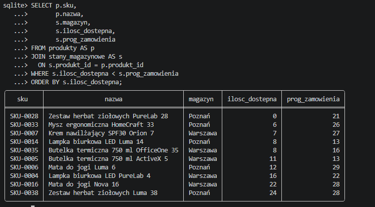

Ćwiczenia SQL

1.
Wyświetl aktywne produkty marki Nova.

2.
Znajdź produkty w cenie netto od 50 do 150 zł.

3.
Policz produkty w każdej kategorii.

4.
Oblicz średnią cenę produktu według kategorii.

5.
Oblicz sprzedaż netto według miesięcy 2025 roku.

6.
Znajdź pięć produktów z największą liczbą sprzedanych sztuk.

7.
Oblicz zysk i marżę według kategorii.

8.
Porównaj sprzedaż klientów B2C i B2B.

9.
Znajdź produkty poniżej progu zamówienia w magazynie.

10.
Oblicz udział kanałów dystrybucji w sprzedaży netto.

Status projektu

Projekt zawiera gotową bazę SQLite, dump SQL, dokumentację uruchomienia, przykładowe zapytania oraz 18 screenów pokazujących kolejne etapy pracy z bazą.

